# Firestore Schema Visual Diagrams

This document provides visual representations of the Firestore database schema.

## Collection Hierarchy

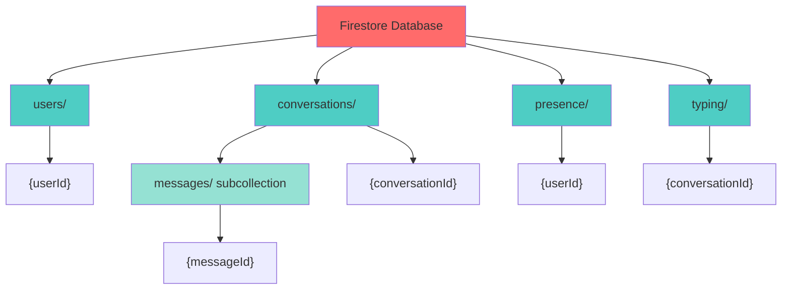

## Users Collection Structure

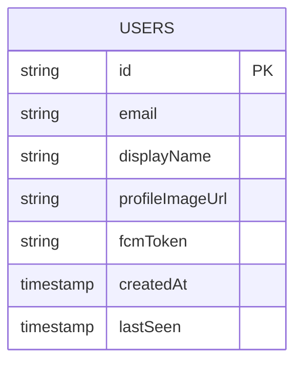

## Conversations & Messages Structure

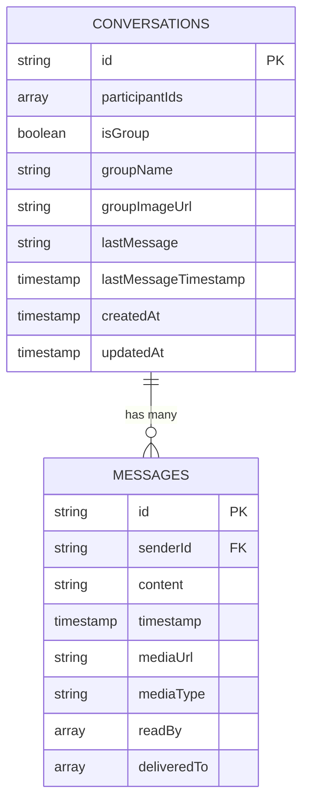

## Presence & Typing Structure

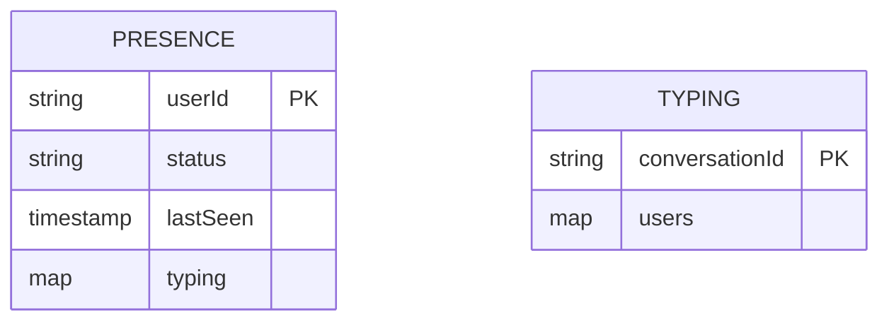

## Data Flow: Sending a Message

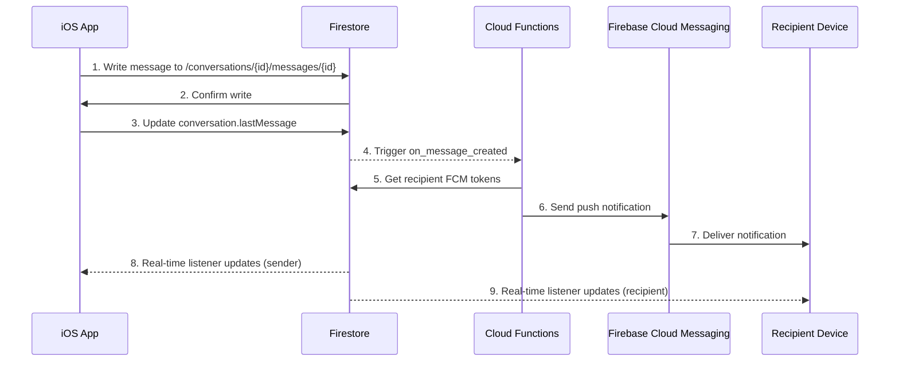

## Data Flow: Real-Time Messaging

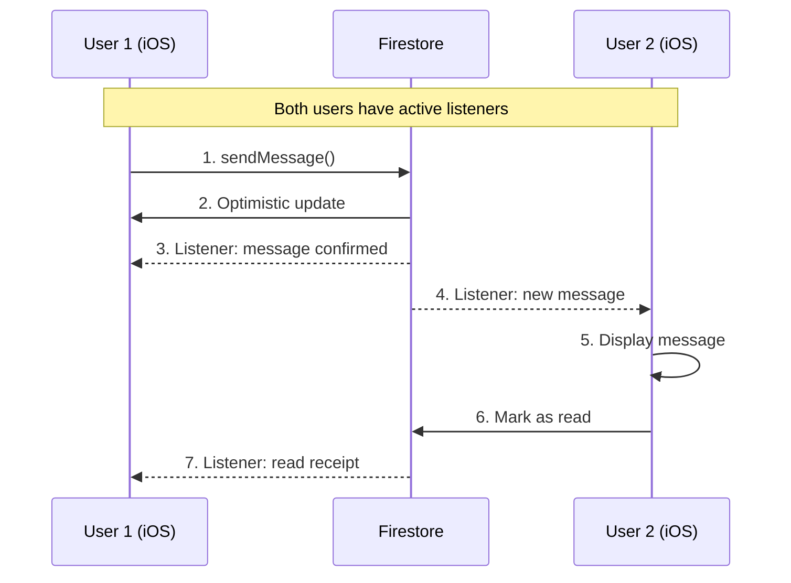

## Data Flow: Offline Support

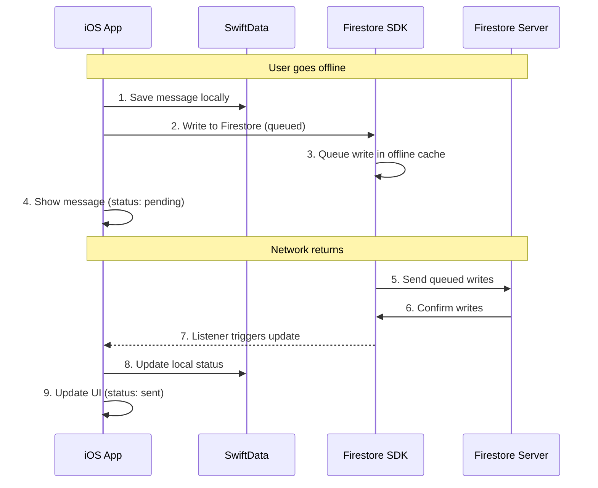

## Security Rules Structure

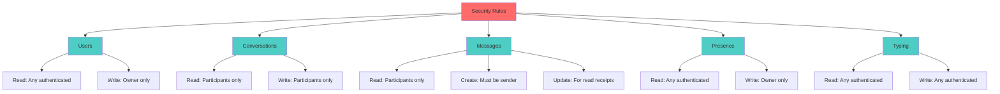

## Indexes Structure

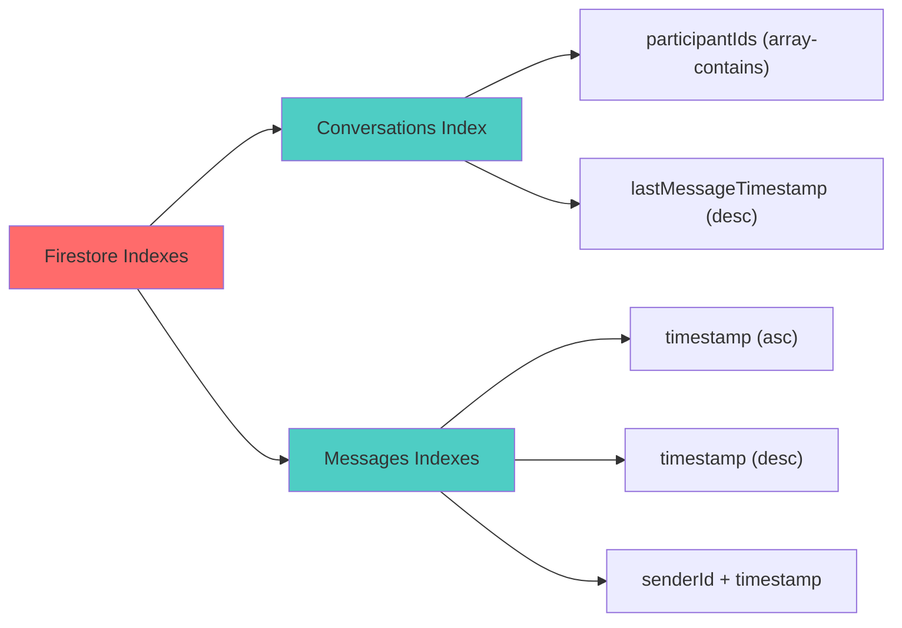

## Conversation Types

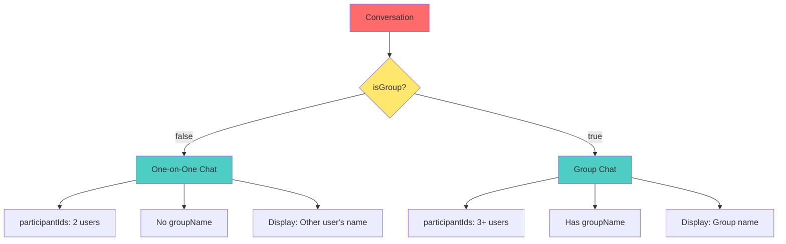

## Message Status Lifecycle

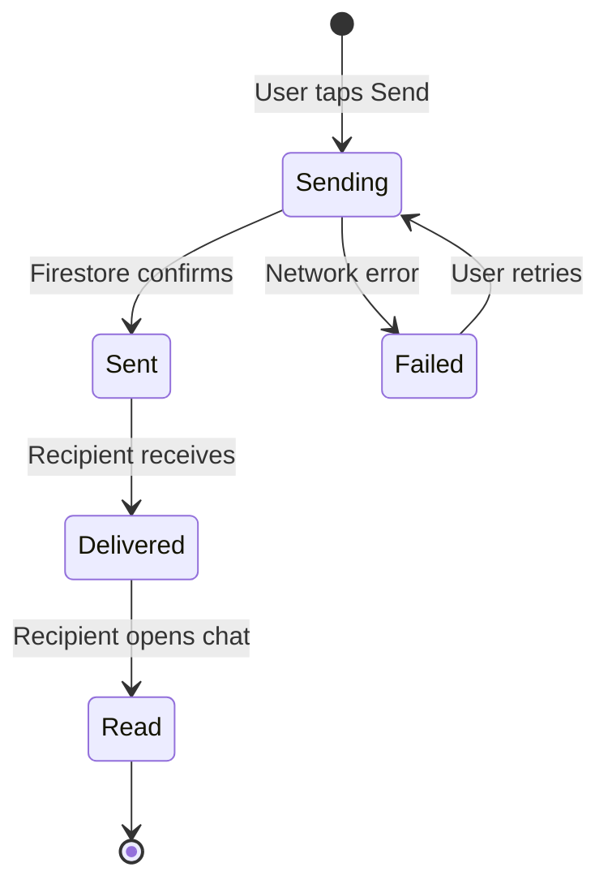

## User Presence States

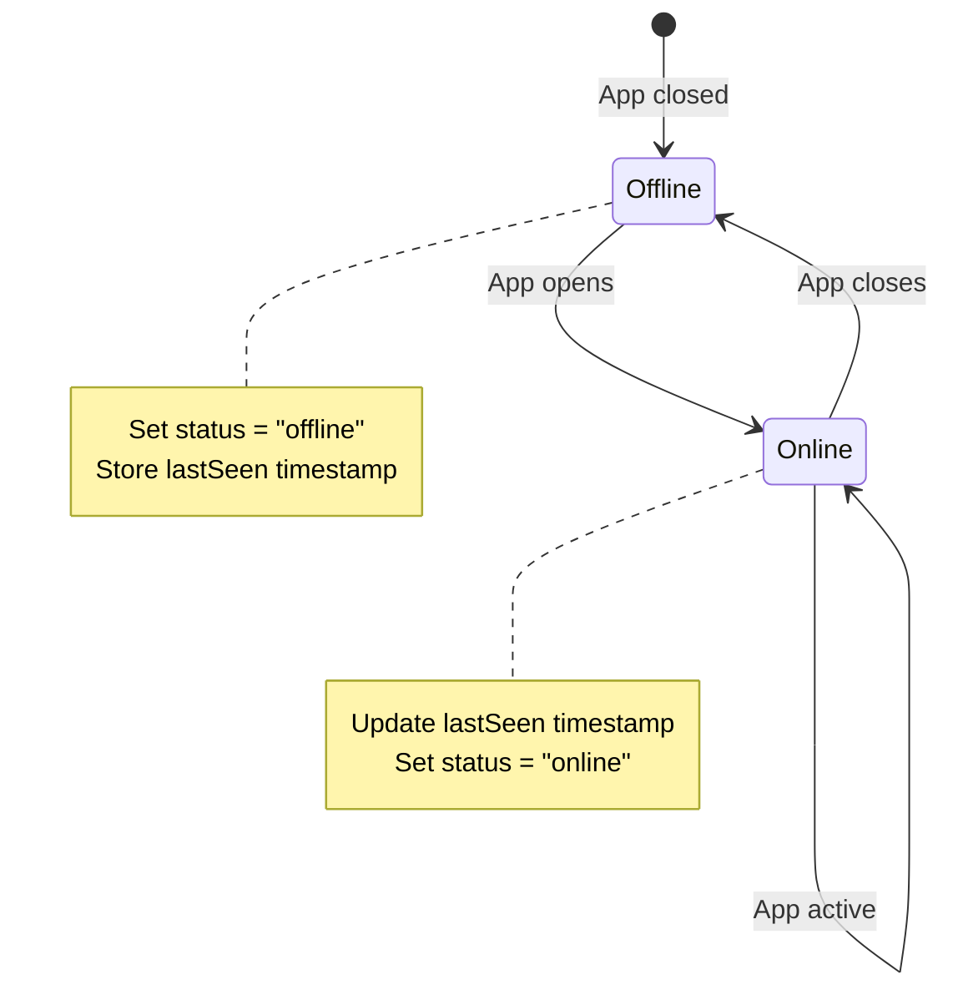

## Complete Entity Relationship Diagram

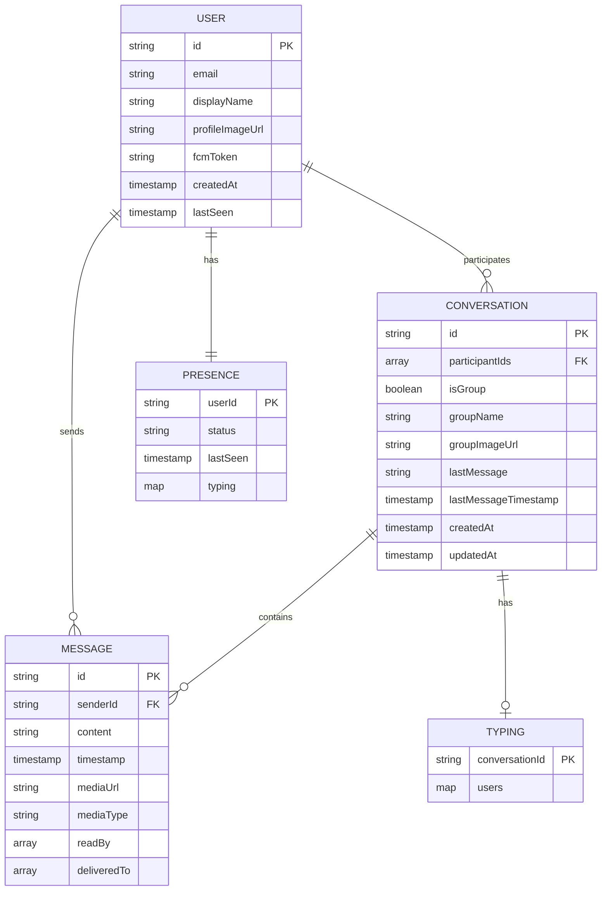

## Cloud Functions Triggers

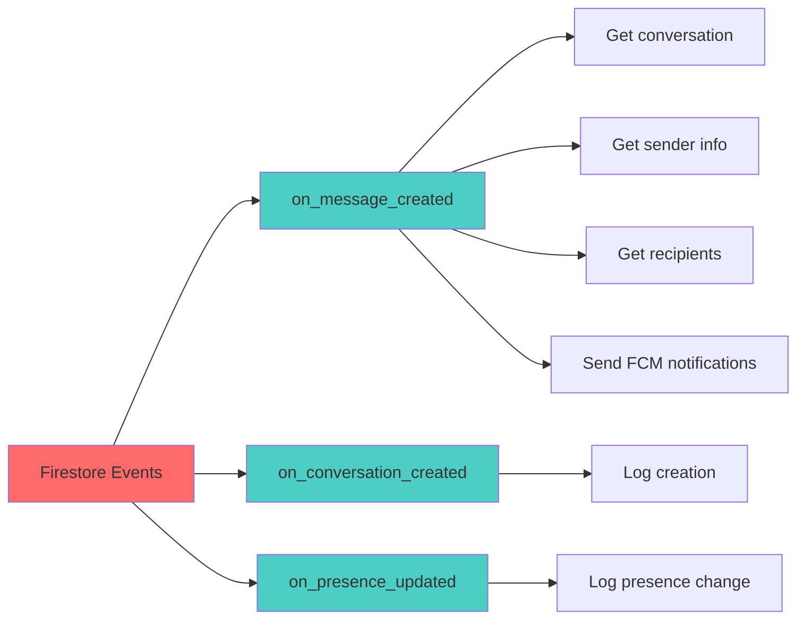

## Data Synchronization Pattern

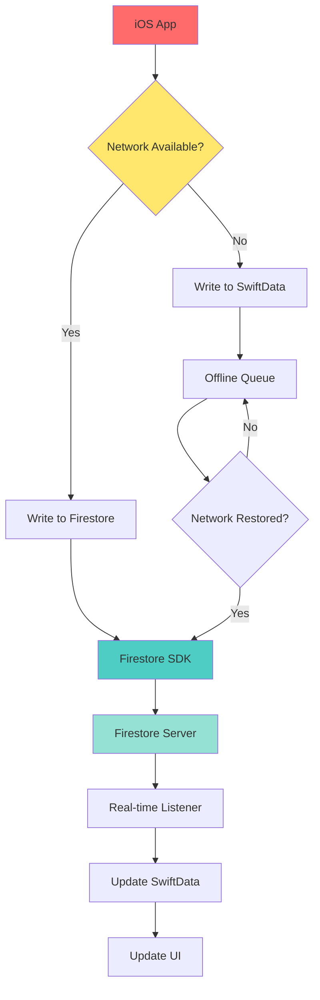

## Query Patterns

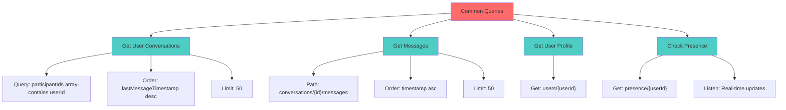

---

## Legend

- 🔴 Red: Main entities/systems
- 🔵 Blue: Collections/sub-systems
- 🟢 Green: Subcollections/nested data
- 🟡 Yellow: Decision points

---

**Last Updated:** October 21, 2025

